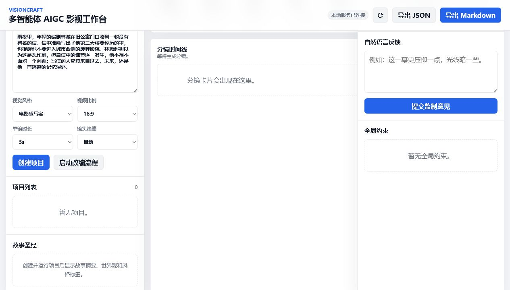
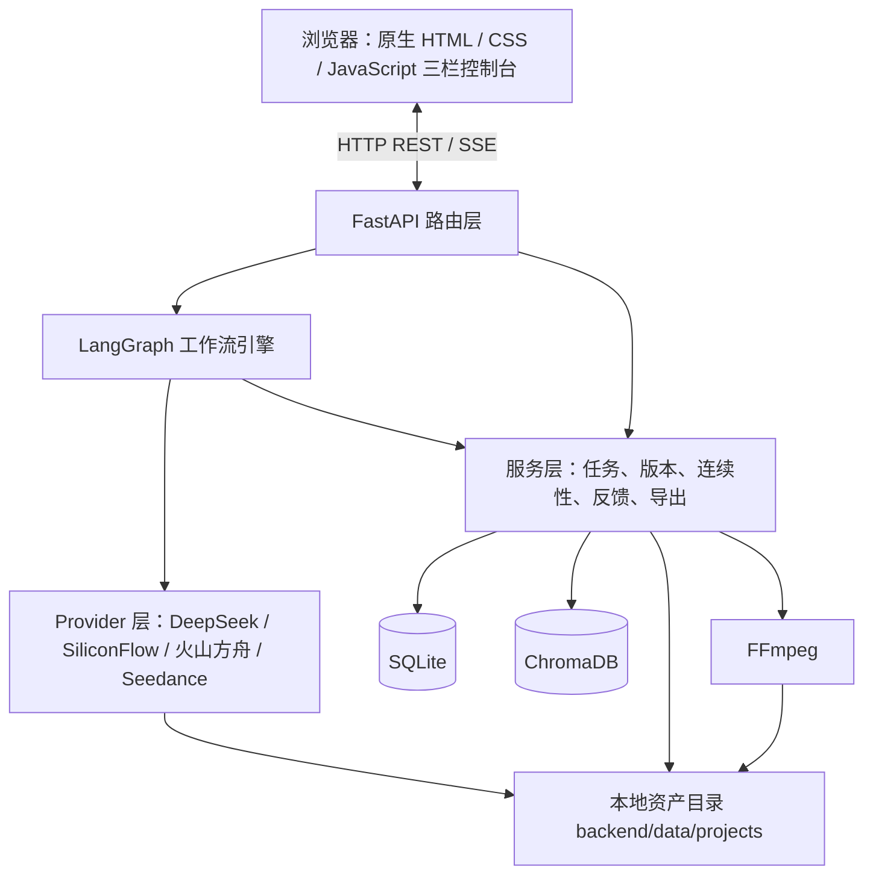
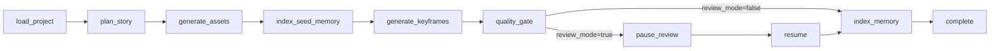

<div align="center">

# VisionCraft

**多智能体 AIGC 影视工作台：从故事文本生成分镜、关键帧、短镜头视频与可导出成片**

[](https://www.python.org/)
[](https://fastapi.tiangolo.com/)
[](https://langchain-ai.github.io/langgraph/)
[](https://www.trychroma.com/)
[](https://ffmpeg.org/)

</div>

VisionCraft 是一个本地运行的 AIGC 视频生产工作台。用户输入故事文本后，系统会生成故事圣经、角色与场景设定、分镜脚本、首尾关键帧、单镜头视频，并在素材齐备后调用 FFmpeg 合成为成片。项目采用原生 HTML/CSS/JavaScript 前端和 FastAPI 后端，后端通过 LangGraph 编排多阶段 Agent 工作流，用 ChromaDB 保存项目级文本与视觉资产记忆，用 SQLite 持久化项目、镜头、版本、任务和检查点。



## 目录

- [功能概览](#功能概览)
- [系统架构](#系统架构)
- [工作流](#工作流)
- [技术栈](#技术栈)
- [后端模块](#后端模块)
- [前端模块](#前端模块)
- [数据模型](#数据模型)
- [关键设计](#关键设计)
- [快速开始](#快速开始)
- [环境变量](#环境变量)
- [检索评测](#检索评测)
- [常见问题](#常见问题)
- [项目结构](#项目结构)
- [边界与后续计划](#边界与后续计划)

## 功能概览

| 能力 | 状态 | 说明 |
| --- | --- | --- |
| 文本输入 | 已实现 | 支持粘贴文本、拖拽上传 `.txt`、`.md`、`.markdown`、`.json` |
| 项目管理 | 已实现 | 创建、读取、删除、归档清理、JSON/Markdown 导出 |
| 路由策略 | 已实现 | 按文本长度进入 direct / chunk / rag 规划路径 |
| LangGraph 工作流 | 已实现 | 编剧、导演、原画、监制、记忆索引等节点化编排 |
| 人工监制 | 已实现 | review mode 下保存检查点，用户确认后恢复 |
| RAG 记忆 | 已实现 | ChromaDB 索引原文、故事圣经、角色、场景、镜头和资产 |
| 图像生成 | 已实现 | 支持火山方舟、SiliconFlow 图像接口与本地开发兜底 |
| 关键帧管理 | 已实现 | 首尾帧生成、重绘、手动选择、相邻镜头连续性同步 |
| 视频生成 | 已实现 | 支持 T2V、I2V、首尾帧模式，保存远程任务状态 |
| Seedance 回查 | 已实现 | 远程任务超时后可通过任务号再次查询并回填结果 |
| 版本回溯 | 已实现 | 每次反馈、重绘、重试生成新版本，可回滚 |
| 成片合成 | 已实现 | FFmpeg 合成前校验真实模型视频来源 |
| 任务同步 | 已实现 | FastAPI BackgroundTasks + SSE + 前端轮询兜底 |
| 生产化加固 | 已实现 | 防重入锁、Embedding Provider、检索评测、Pydantic 校验重试 |

## 系统架构



一次“开始生成”的请求会进入 `POST /api/projects/{project_id}/run`。路由层先创建 job，并用进程内 per-project lock 防止同一项目重复启动。实际工作流通过 FastAPI `BackgroundTasks` 执行，接口立即返回 `job_id` 和 `queued` 状态。前端随后通过 `/api/projects/{project_id}/events` 建立 SSE 连接，后端每秒读取项目快照和 job 快照，有变化就推给前端；连接失败时，前端会用轮询补齐状态。

生成图片、视频和成片文件都写入 `backend/data/projects/{project_id}/`。数据库保存文件路径、Provider 来源、版本信息和远程任务号，文件本体不写进 SQLite。FastAPI 通过 `app.mount("/assets", StaticFiles(directory=PROJECTS_DIR), name="assets")` 暴露本地资产访问路径。

## 工作流



`VisionCraftState` 在节点之间传递项目 id、job id、输入参数、镜头数、故事数据、角色资产、场景资产、RAG 证据、路由模式、监制模式和检查点 id。项目的阶段顺序是确定的，所以流程控制交给 LangGraph，模型的创造性限制在节点内部。这种写法比自由对话式多 Agent 更容易调试，也方便在失败时定位到具体节点。

工作流中的主要 Agent：

| Agent | 位置 | 职责 |
| --- | --- | --- |
| Narrative Planner | `plan_story` | 生成故事圣经、角色、场景、分镜脚本和音频提示 |
| Visual Director | `generate_assets` | 生成角色与场景基准资产 |
| Key Animator | `generate_keyframes` | 检索 RAG 证据，生成首尾关键帧 |
| Visual Critic | `quality_gate` | 检查镜头是否具备完整关键帧 |
| Human Producer | `pause_review` / `resume` | 监制模式下确认或继续流程 |
| Sequence Assembler | `video_service.py` | 生成镜头视频并调用 FFmpeg 合成 |

## 技术栈

| 层级 | 技术 |
| --- | --- |
| 前端 | HTML, CSS, JavaScript |
| 后端 | Python 3.10+, FastAPI, Pydantic v2 |
| 工作流 | LangGraph |
| 数据库 | SQLite |
| 向量记忆 | ChromaDB |
| 文本模型 | DeepSeek / SiliconFlow OpenAI-compatible chat API |
| 图像模型 | 火山方舟图像接口 / SiliconFlow Image |
| 视频模型 | Seedance / SiliconFlow Video |
| 媒体处理 | FFmpeg |
| 状态同步 | Server-Sent Events, fetch polling |

## 后端模块

| 模块 | 路径 | 说明 |
| --- | --- | --- |
| API | `backend/main.py` | 项目、工作流、反馈、关键帧、视频、记忆、导出接口 |
| 配置 | `backend/config.py` | `.env` 加载、数据目录和资产目录初始化 |
| 数据库 | `backend/database.py` / `backend/schema.sql` | SQLite 连接、迁移、表结构 |
| 工作流 | `backend/workflow/langgraph_workflow.py` | LangGraph 状态机、暂停、恢复、重试 |
| 本地兜底 | `backend/workflow/mock_workflow.py` | Provider 不可用时的结构化开发路径 |
| LLM Provider | `backend/providers/llm_provider.py` | 故事规划、JSON 解析、Pydantic 校验重试、安全改写 |
| Embedding Provider | `backend/providers/embedding_provider.py` | hash embedding 与 SiliconFlow embedding 抽象 |
| 图像 Provider | `backend/providers/image_provider.py` | 角色图、场景图、关键帧生成 |
| 视频 Provider | `backend/providers/video_provider.py` | 视频任务提交、轮询、回查、下载、错误归一化 |
| 项目服务 | `backend/services/project_service.py` | 项目 CRUD、路由计算、镜头数计算、状态更新 |
| 记忆服务 | `backend/services/memory_service.py` | ChromaDB 索引、检索、RAG 证据生成 |
| 任务服务 | `backend/services/job_service.py` | job 创建、状态更新、防重入锁、孤儿任务清理 |
| 关键帧服务 | `backend/services/keyframe_service.py` | 重绘、选择、相邻镜头连续性同步 |
| 反馈服务 | `backend/services/feedback_service.py` | 自然语言反馈、局部/全局作用域、版本生成 |
| 视频服务 | `backend/services/video_service.py` | 单镜头视频、批量视频、远程回查、FFmpeg 合成 |
| 检查点服务 | `backend/services/checkpoint_service.py` | review mode 暂停状态保存与恢复 |
| 导出服务 | `backend/services/export_service.py` | JSON / Markdown 导出 |

## 前端模块

| 模块 | 路径 | 说明 |
| --- | --- | --- |
| 页面结构 | `frontend/index.html` | 三栏控制台、项目表单、镜头面板、任务栏 |
| 样式 | `frontend/css/style.css` | 控制台布局、状态色、卡片、响应式约束 |
| 状态 | `frontend/js/state.js` | 当前项目、选中镜头、Provider 能力、派生选择器 |
| API | `frontend/js/api.js` | fetch 封装、错误解析、后端接口调用 |
| 应用逻辑 | `frontend/js/app.js` | 事件绑定、文件上传、SSE、轮询、任务触发 |
| 渲染 | `frontend/js/render.js` | 项目列表、镜头、资产、监制面板、版本历史 |

前端保持原生三件套实现，减少构建链和运行依赖。三栏布局对应“项目上下文、生产时间线、当前镜头监制”三个工作区。镜头视频生成时间较长，底部任务栏常驻显示 job 状态和错误信息，右侧面板显示当前镜头的 prompt、RAG 证据、关键帧、视频和版本记录。

## 数据模型

| 表 | 作用 |
| --- | --- |
| `projects` | 项目元数据、原文、风格、比例、路由模式、状态 |
| `story_bibles` | 摘要、世界观、主题和风格标签 |
| `characters` | 角色设定、视觉提示和角色资产 |
| `scenes` | 场景设定、视觉提示和场景资产 |
| `shots` | 分镜脚本、RAG 证据、状态、当前版本 |
| `shot_versions` | 每次重绘、反馈、重试后的镜头版本 |
| `assets` | 图片、视频、成片等本地文件路径和来源标记 |
| `video_tasks` | 远程视频任务号、云端状态、错误码、结果路径 |
| `feedback_records` | 用户反馈文本、作用域、解析结果 |
| `jobs` | 后台任务进度、状态、错误和重试次数 |
| `workflow_checkpoints` | 监制模式下的可恢复状态 |

`shots` 保存镜头身份，`shot_versions` 保存可回滚结果。反馈、重绘、关键帧选择和安全重试都会生成新版本，再把 `shots.current_version_id` 指向新版本。历史版本保留在数据库中，便于回溯生成过程。

## 关键设计

### 1. 输入路由

`project_service.compute_routing_mode` 根据文本长度选择路由：

| 路由 | 条件 | 处理方式 |
| --- | --- | --- |
| `direct` | `< 5000` 字 | 直接请求 LLM 生成故事圣经和分镜 |
| `chunk` | `5000 - 30000` 字 | 源文本按 2600 字、260 overlap 分块，先摘要再合并 |
| `rag` | `> 30000` 字 | 建立项目记忆，分镜生成时检索局部证据 |

RAG memory 的原文索引按 900 字、120 overlap 切分。镜头生成前用镜头标题和描述检索项目记忆，结果写入 `shots.rag_evidence`，前端在右侧监制面板展示证据来源。

### 2. Embedding Provider

检索层通过 `EmbeddingProvider` 协议隔离具体向量模型：

| Provider | collection | 说明 |
| --- | --- | --- |
| `hash` | `visioncraft_memory_hash` | 本地 bigram + blake2b，384 维，无外部依赖 |
| `siliconflow` | `visioncraft_memory_sf_bge-m3` | SiliconFlow `/embeddings`，默认 `BAAI/bge-m3`，1024 维 |

Chroma collection 按 Provider 隔离，避免 384 维和 1024 维向量混写。检索后会做 hybrid rerank，默认权重为：

```text
hash:        lexical 0.8 + vector 0.2
siliconflow: lexical 0.3 + vector 0.7
```

SiliconFlow key 缺失、余额不足或网络失败时，进程内会降级到 hash embedding，并在日志中记录原因。

### 3. Pydantic 结构化校验

编剧 Agent 输出先经过 JSON 解析，再进入 Pydantic v2 schema：

```text
StoryPlanModel
  summary / worldview / style_tags / themes
  characters[]
  scenes[]
  shots[]
```

校验失败后，系统把错误摘要追加给 LLM 进行修复，默认最多修复 2 次。多次修复后仍然失败时，如果最后一次响应至少能解析为 JSON，系统会进入 `_coerce_story_plan` 兜底，并把 `_validation.status` 标记为 `coerced_after_validation_failure`。连 JSON 都无法解析时，工作流回退到本地 planner。

### 4. 防重入锁

同一项目不能同时启动两个 full workflow。`job_service.py` 用进程内 `{project_id: threading.Lock}` 包裹“检查活跃 job + 创建新 job”的临界区，并在 FastAPI startup 时把历史 `queued/running` job 标记为 orphan failed。

该锁适用于单进程 FastAPI BackgroundTasks 场景。多 worker 或分布式部署需要迁移到 Redis lock、数据库行锁或任务队列。

### 5. 关键帧连续性

镜头 N 的尾帧更新后，系统会把它同步为镜头 N+1 的首帧，并清空下一个镜头的旧视频引用。这样可以减少“关键帧已变，视频仍沿用旧输入”的问题。用户也可以手动选择已有资产作为首帧或尾帧，系统会生成新版本并保留旧版本。

### 6. 视频任务回查

Seedance 这类视频接口通常是远程异步任务。系统保存 `remote_task_id`、云端状态、提交 payload、状态 payload、错误码和错误信息。若本地轮询超时但云端仍在运行，job 会进入 `waiting_remote`，用户稍后可以点击“回查 Seedance 任务”恢复结果。

### 7. 成片来源校验

早期开发阶段的静帧占位视频不会进入最终合成。FFmpeg 合成前会检查每个镜头的视频来源，只有真实模型 Provider 生成的单镜头视频可以进入 final cut。

## 快速开始

### 环境要求

| 依赖 | 建议 |
| --- | --- |
| Python | 3.10+ |
| FFmpeg | 加入系统 `PATH` |
| 浏览器 | Chrome / Edge |
| 网络 | 能访问配置的模型 API |

### 安装

```powershell
git clone https://github.com/Bamzzo/VisionCraft.git
cd VisionCraft

python -m venv .venv
.\.venv\Scripts\Activate.ps1

pip install -r requirements.txt
Copy-Item .env.example .env
```

### 启动

```powershell
python -m uvicorn backend.main:app --host 127.0.0.1 --port 8000
```

浏览器打开：

```text
http://127.0.0.1:8000
```

端口被占用时可以换端口：

```powershell
python -m uvicorn backend.main:app --host 127.0.0.1 --port 8010
```

## 环境变量

复制 `.env.example` 为 `.env` 后填入自己的 key。`.env` 已被 `.gitignore` 忽略，不应提交到仓库。

常用配置：

```text
VISIONCRAFT_PROVIDER_MODE=live
VISIONCRAFT_IMAGE_PROVIDER=ark
VISIONCRAFT_VIDEO_PROVIDER=ark

DEEPSEEK_API_KEY=
SILICONFLOW_API_KEY=
VOLC_API_KEY=
VOLC_IMAGE_API_KEY=
VOLC_VIDEO_API_KEY=

DOUBAO_IMAGE_ENDPOINT=
SEEDANCE_V2_ENDPOINT=doubao-seedance-2-0-260128

EMBEDDING_PROVIDER=hash
EMBEDDING_MODEL=BAAI/bge-m3
HYBRID_LEXICAL_WEIGHT=0.8
HYBRID_VECTOR_WEIGHT=0.2
PLAN_VALIDATION_MAX_RETRIES=2
```

Provider 建议：

| 目标 | 建议 |
| --- | --- |
| 文本规划 | DeepSeek 或 SiliconFlow OpenAI-compatible chat API |
| 图像生成 | 火山方舟图像模型或 SiliconFlow Image |
| 视频生成 | Seedance 接入点 |
| 本地开发 | 保留 mock/fallback 配置，先验证界面和工作流 |
| 检索质量 | 可用时把 `EMBEDDING_PROVIDER` 切到 `siliconflow` 并使用 BGE 类模型 |

## 检索评测

项目内置了一个可复现的检索评测集，位于 `eval/`：

```powershell
$env:EMBEDDING_PROVIDER='hash'
python eval\dump_memory_labels.py
python eval\run_retrieval_eval.py --provider hash --mode hybrid --k 2
python eval\run_retrieval_eval.py --provider hash --mode hybrid --k 5
```

当前 hash 基线结果见 `eval/results.md`。SiliconFlow live embedding 评测需要账户余额和 key 可用：

```powershell
$env:EMBEDDING_PROVIDER='siliconflow'
$env:HYBRID_LEXICAL_WEIGHT='0.3'
$env:HYBRID_VECTOR_WEIGHT='0.7'
python eval\run_retrieval_eval.py --provider siliconflow --mode hybrid --k 5
```

评测脚本会重建 synthetic 项目 `eval_project_001`，请串行执行。

## 常见问题

| 现象 | 常见原因 | 处理 |
| --- | --- | --- |
| 图片是 SVG | 图像 Provider 未配置或调用失败 | 检查图像 key、模型权限和接入点 |
| 视频显示等待远程 | 云端视频任务仍在运行 | 稍后点击回查任务 |
| 视频被策略拦截 | Prompt 包含风险表述或平台策略限制 | 使用安全改写后重试 |
| 提示余额或并发限制 | 平台账户额度不足或并发受限 | 检查控制台账单和限流配置 |
| 成片合成失败 | 有镜头没有真实模型视频 | 先生成或回查对应镜头 |
| 页面没有实时更新 | SSE 断开或任务仍在执行 | 前端轮询会兜底，必要时刷新页面 |
| 端口被占用 | 本机已有服务使用 8000 | 换端口启动或结束旧进程 |

## 项目结构

```text
visioncraft/
  backend/
    main.py
    config.py
    database.py
    schema.sql
    providers/
    services/
    workflow/
  frontend/
    index.html
    css/style.css
    js/api.js
    js/app.js
    js/render.js
    js/state.js
  docs/
    production_hardening_log.md
  eval/
    dump_memory_labels.py
    eval_support.py
    memory_labels_dump.md
    results.md
    retrieval_eval_set.json
    run_retrieval_eval.py
  tools/
    story_plan_validation_smoke.py
  requirements.txt
  README.md
  .env.example
```

## 边界与后续计划

当前版本面向本地单用户运行。SQLite、进程内锁和 FastAPI BackgroundTasks 适合本地演示与开发调试；多人并发或长时间生产任务需要升级：

- SQLite 迁移到 PostgreSQL。
- 进程内 lock 迁移到 Redis lock、数据库行锁或队列幂等键。
- BackgroundTasks 迁移到 Celery / RQ / Dramatiq 等 worker 队列。
- 本地资产目录迁移到对象存储。
- ChromaDB 本地持久化迁移到独立向量服务或 pgvector。
- 前端在多人协作、复杂状态和权限管理场景下迁移到 React / Vue。

已加入的生产化改造记录在 `docs/production_hardening_log.md`。其中 SiliconFlow embedding live 评测因账户余额不足标记为 `PENDING_LIVE_KEY`，key 与余额就绪后可按文档中的命令补跑。
