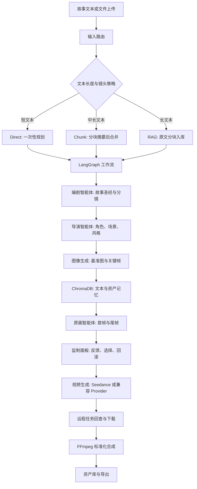

<div align="center">

# VisionCraft

**多智能体 AIGC 影视工作台：把故事文本拆成分镜、关键帧、视频片段和可导出的成片**

[](https://www.python.org/)
[](https://fastapi.tiangolo.com/)
[](https://langchain-ai.github.io/langgraph/)
[](https://www.trychroma.com/)
[](https://ffmpeg.org/)

</div>

VisionCraft 是一个本地运行的 AIGC 视频生产工作台。它把一段故事文本转成故事圣经、角色设定、场景设定、分镜脚本、首尾关键帧、短镜头视频和最终成片。项目采用原生 HTML/CSS/JavaScript 前端和 FastAPI 后端，后端用 LangGraph 编排多智能体工作流，用 ChromaDB 保存项目级文本记忆和视觉资产索引，用 FFmpeg 完成视频标准化封装。

这个项目主要处理两个真实问题：

- 长文本改编时，模型容易丢失设定、人物关系和前后文细节。
- 多镜头生产时，角色、场景、色调和动作衔接容易断裂。

VisionCraft 的做法是把生成过程拆开：先建立故事和视觉锚点，再按镜头生产关键帧和视频；每一步都保留状态、资产、版本、错误和回查入口，用户可以在工作台中监制、重绘、回滚和重试。


## 目录

- [功能状态](#功能状态)
- [工作流概览](#工作流概览)
- [界面设计](#界面设计)
- [技术栈](#技术栈)
- [后端结构](#后端结构)
- [前端结构](#前端结构)
- [数据模型](#数据模型)
- [核心设计](#核心设计)
- [快速开始](#快速开始)
- [环境变量](#环境变量)
- [使用流程](#使用流程)
- [常见问题](#常见问题)
- [项目结构](#项目结构)
- [开发计划](#开发计划)
- [运行数据与配置](#运行数据与配置)

## 功能状态

| 能力 | 当前状态 | 说明 |
| --- | --- | --- |
| 文本输入 | 已完成 | 支持粘贴文本、拖拽上传 `.txt`、`.md`、`.json` 文件 |
| 项目管理 | 已完成 | 支持项目创建、列表读取、删除、导出 |
| 文本路由 | 已完成 | 根据文本长度选择 `direct`、`chunk`、`rag` 路线 |
| 多智能体工作流 | 已完成 | LangGraph 节点化编排，状态写入数据库 |
| 记忆检索 | 已完成 | ChromaDB 项目记忆，镜头侧展示 RAG 证据 |
| 图像生成 | 已完成 | 支持火山方舟和 SiliconFlow 图像接口，本地占位用于开发兜底 |
| 关键帧管理 | 已完成 | 支持首尾帧生成、重绘、手动选择和相邻镜头连续性更新 |
| 视频生成 | 已完成 | 支持 T2V、I2V、首尾帧模式，保存远程任务号和错误信息 |
| Seedance 回查 | 已完成 | 云端任务未完成时可稍后回查并下载结果 |
| 版本历史 | 已完成 | 反馈、重绘、重试都会生成新版本，支持回滚 |
| 成片合成 | 已完成 | FFmpeg 合成前检查真实视频来源，避免静帧占位混入成片 |
| 任务同步 | 已完成 | Server-Sent Events 加前端轮询兜底 |

## 工作流概览



系统把一次生成任务拆成多个可观察阶段。前端展示项目状态、Agent 状态、镜头状态、任务进度和错误信息；后端把分镜、资产、版本、视频任务和检查点写入 SQLite。这样做的好处是：一次生成失败后，用户可以定位到具体镜头和具体任务，不需要把整个项目从头跑一遍。

## 界面设计

VisionCraft 采用三栏控制台布局，重点放在生产过程本身，避免把创作工具做成展示页式的介绍。

| 区域 | 内容 | 设计原因 |
| --- | --- | --- |
| 左侧 | 项目创建、文本上传、项目列表、故事圣经、Provider 诊断 | 创作入口和项目上下文集中放置，方便切换项目和检查环境 |
| 中间 | Agent 状态流、资产摘要、分镜时间线、批量视频、成片合成 | 镜头生产的主工作区，用户能按顺序检查每个镜头 |
| 右侧 | 当前镜头、首尾帧、视频预览、Prompt、RAG 证据、反馈、版本历史 | 监制操作集中在一个面板中，减少来回跳转 |
| 底部 | 任务队列、进度、状态、错误 | 后台任务可能持续数分钟，底部任务栏保持可见 |

界面选择清晰、低装饰的控制台风格。按钮、标签、状态色和媒体卡片都围绕“当前能做什么”和“当前哪里出错”组织。图像、视频、RAG 证据、Prompt 和版本记录同屏展示，用户可以把模型输出和生成依据放在一起判断。

## 技术栈

| 层级 | 技术 |
| --- | --- |
| 前端 | HTML, CSS, JavaScript |
| 后端 | Python, FastAPI, Pydantic |
| 工作流 | LangGraph |
| 数据库 | SQLite |
| 记忆检索 | ChromaDB |
| 文本模型 | DeepSeek, SiliconFlow 兼容 OpenAI 格式接口 |
| 图像生成 | 火山方舟图像模型, SiliconFlow Image |
| 视频生成 | Seedance, SiliconFlow Video |
| 媒体处理 | FFmpeg |
| 状态同步 | Server-Sent Events, 前端轮询 |
| 配置管理 | python-dotenv |

## 后端结构

| 模块 | 路径 | 说明 |
| --- | --- | --- |
| API 入口 | `backend/main.py` | FastAPI 路由，挂载前端静态资源，提供项目、工作流、反馈、视频、导出接口 |
| 配置 | `backend/config.py` | 读取 `.env`，初始化数据库目录、项目资产目录和 ChromaDB 目录 |
| 数据库 | `backend/database.py` | SQLite 连接、JSON 序列化、时间戳和轻量迁移 |
| 数据表 | `backend/schema.sql` | 项目、故事圣经、角色、场景、分镜、版本、资产、任务、检查点 |
| 工作流 | `backend/workflow/langgraph_workflow.py` | LangGraph 状态机，组织前制、关键帧、监制、记忆索引等节点 |
| Mock 工作流 | `backend/workflow/mock_workflow.py` | 本地调试和 Provider 失败时的结构化数据兜底 |
| LLM Provider | `backend/providers/llm_provider.py` | 故事规划、分镜生成、Prompt 生成、视频安全改写 |
| 图像 Provider | `backend/providers/image_provider.py` | 角色图、场景图和关键帧生成，失败时写入可辨识占位资产 |
| 视频 Provider | `backend/providers/video_provider.py` | 视频任务提交、轮询、回查、下载、错误归一化 |
| Provider 能力 | `backend/providers/capabilities.py` | 根据环境变量和本地依赖输出当前可用能力 |
| 项目服务 | `backend/services/project_service.py` | 项目创建、读取、删除、状态更新、版本查询 |
| 记忆服务 | `backend/services/memory_service.py` | 原文分块、资产索引、ChromaDB 检索、RAG 证据整理 |
| 关键帧服务 | `backend/services/keyframe_service.py` | 关键帧重绘、手动选择、相邻镜头首尾帧传递 |
| 反馈服务 | `backend/services/feedback_service.py` | 自然语言反馈解析，区分局部修改和全局约束 |
| 视频服务 | `backend/services/video_service.py` | 单镜视频、批量视频、远程回查、安全重试、成片合成 |
| 任务服务 | `backend/services/job_service.py` | 后台任务状态、进度、错误和重试次数 |
| 导出服务 | `backend/services/export_service.py` | 项目 JSON 和 Markdown 导出 |
| 检查点服务 | `backend/services/checkpoint_service.py` | 监制模式下的暂停点保存和恢复 |

## 前端结构

| 模块 | 路径 | 说明 |
| --- | --- | --- |
| 页面结构 | `frontend/index.html` | 三栏工作台 DOM、表单、媒体区域和任务栏 |
| 样式 | `frontend/css/style.css` | 控制台布局、状态色、资产卡片、分镜网格和响应式约束 |
| 状态 | `frontend/js/state.js` | 当前项目、选中镜头、Provider 能力、轮询状态和派生选择器 |
| API | `frontend/js/api.js` | Fetch 封装、错误解析、项目和视频接口 |
| 应用逻辑 | `frontend/js/app.js` | 事件绑定、文本上传、SSE 监听、轮询兜底、任务触发 |
| 渲染 | `frontend/js/render.js` | 项目列表、分镜、资产、监制面板、版本历史、任务栏 |

前端没有使用框架，所有界面状态都由一个集中 `state` 对象管理。项目列表和分镜列表采用事件委托，避免 DOM 重绘后事件丢失。后台任务先走 SSE，如果浏览器连接断开或任务没有推送完成，前端会启用轮询补齐状态。

## 数据模型

| 表 | 作用 |
| --- | --- |
| `projects` | 项目元数据、原文、风格、比例、状态、路由模式 |
| `story_bibles` | 摘要、世界观、主题、视觉基调 |
| `characters` | 角色设定、角色图路径、视觉 Prompt |
| `scenes` | 场景设定、场景图路径、视觉 Prompt |
| `shots` | 分镜脚本、镜头状态、RAG 证据、当前版本 |
| `shot_versions` | 每次重绘、反馈、重试后的版本内容 |
| `assets` | 图片、视频、成片等本地文件及来源标记 |
| `video_tasks` | 远程任务号、云端状态、错误码、本地结果路径 |
| `feedback_records` | 用户反馈文本、作用域、解析结果 |
| `jobs` | 后台任务状态、进度、错误和重试次数 |
| `workflow_checkpoints` | 监制模式暂停点和可恢复状态 |

分镜和版本分离是项目里比较关键的一点。`shots` 保存镜头的稳定身份，`shot_versions` 保存每次生成和修改的结果。用户重绘关键帧或提交反馈时，系统创建新版本并把 `shots.current_version_id` 指向新版本，旧版本仍然保留。

## 核心设计

### 1. LangGraph 状态机

工作流按生产顺序拆成多个节点：读取项目、规划故事、生成角色和场景、索引初始记忆、生成关键帧、质检、监制暂停、索引最终记忆、完成项目。每个节点只处理一个明确阶段，前端可以把状态显示到具体 Agent 阶段。

工作流失败时，后端会记录任务错误并更新项目状态。监制模式下，流程可以在关键帧完成后保存检查点，等待用户确认后继续运行。

### 2. 输入路由

项目根据原文长度和用户镜头策略选择处理路线：

| 路线 | 使用场景 | 处理方式 |
| --- | --- | --- |
| `direct` | 短文本、测试片段 | 直接生成故事圣经和分镜 |
| `chunk` | 中等长度文本 | 分块摘要后合并成故事圣经 |
| `rag` | 长文本或设定密集文本 | 原文分块入库，镜头生成时检索相关片段 |

当前版本优先保证本地可运行和结构完整。长文本 RAG 路线使用 ChromaDB 持久化索引，检索结果会写入镜头证据并显示在右侧监制面板。

### 3. ChromaDB 项目记忆

系统索引以下内容：

- 原文分块。
- 故事圣经。
- 角色设定。
- 场景设定。
- 分镜描述。
- 生成资产描述。

当前嵌入函数采用轻量 hash embedding，并叠加中文短文本的字面重合度评分。这样可以在不额外申请 embedding 模型的情况下完成本地检索演示。后续可以替换为 BGE、Qwen Embedding 或火山向量化模型。

### 4. Provider 抽象

LLM、图像和视频模型都封装在 `backend/providers/` 下。工作流和业务服务只关心统一返回结构，不直接依赖某个厂商的请求格式。这样可以在 DeepSeek、SiliconFlow、火山方舟、Seedance 之间切换，也方便保留本地调试兜底。

### 5. 关键帧连续性

多镜头一致性不能只写在 Prompt 里。VisionCraft 在数据层加入了连续性规则：当某个镜头的尾帧更新后，系统会把它同步为下一镜头的首帧，并清空下一镜头旧视频。这样能避免“关键帧已经变了，但视频还沿用旧输入”的情况。

### 6. 版本管理

反馈、重绘、手动选择关键帧和安全重试都不会覆盖原版本。版本记录包含：

- 镜头描述。
- 视觉 Prompt。
- 负向 Prompt。
- 音频 Prompt。
- 首帧路径。
- 尾帧路径。
- 视频路径。
- 视频模式。
- 版本说明。

版本历史让用户能回到某一次较好的结果，也便于解释“这个镜头为什么变成现在这样”。

### 7. 视频任务回查

Seedance 这类视频模型经常是异步任务。后端会保存远程任务号、云端状态、错误码和错误信息。如果接口返回任务仍在运行，前端会显示等待远程状态，用户稍后可以点击回查。任务成功后，后端下载视频并写回当前镜头版本。

### 8. 失败处理

项目把视频失败分成几类显示：

| 类型 | 前端提示 | 处理方式 |
| --- | --- | --- |
| 内容策略或版权策略 | 内容安全 / 版权策略拦截 | 可触发安全改写后重试 |
| 额度或并发限制 | 平台推理额度或并发限制 | 等待额度恢复或调整平台限制 |
| 权限不足 | 模型或接入点权限不足 | 检查模型、接入点、API Key |
| 其他错误 | 视频任务失败 | 展示原始错误，保留任务记录 |

成片合成前会检查每个镜头的视频来源。只有模型 Provider 生成的单镜视频能进入最终合成，开发调试中的静帧占位视频会被拒绝。

## 快速开始

### 环境要求

| 依赖 | 建议 |
| --- | --- |
| Python | 3.10+ |
| FFmpeg | 已加入系统 PATH |
| 浏览器 | Chrome / Edge |
| 网络 | 能访问所配置的模型 API |

### 安装与启动

```powershell
git clone <your-repo-url>
cd visioncraft

python -m venv .venv
.\.venv\Scripts\Activate.ps1

pip install -r requirements.txt
Copy-Item .env.example .env

python -m uvicorn backend.main:app --host 127.0.0.1 --port 8000
```

浏览器打开：

```text
http://127.0.0.1:8000
```

如果 8000 端口被占用，可以换一个端口：

```powershell
python -m uvicorn backend.main:app --host 127.0.0.1 --port 8010
```

## 环境变量

复制 `.env.example` 为 `.env`，填入自己的 Key 和接入点。`.env` 只用于本地运行，不属于项目示例配置。

```text
VISIONCRAFT_PROVIDER_MODE=live
VISIONCRAFT_IMAGE_PROVIDER=ark
VISIONCRAFT_VIDEO_PROVIDER=ark

DEEPSEEK_API_KEY=
SILICONFLOW_API_KEY=
VOLC_API_KEY=
VOLC_IMAGE_API_KEY=
VOLC_VIDEO_API_KEY=

DOUBAO_IMAGE_ENDPOINT=
SEEDANCE_V2_ENDPOINT=doubao-seedance-2-0-260128
```

Provider 选择建议：

| 目标 | 建议 |
| --- | --- |
| 文本规划 | DeepSeek 或 SiliconFlow 兼容接口 |
| 图像生成 | 火山方舟图像模型或 SiliconFlow Image |
| 视频生成 | Seedance 接入点 |
| 本地调试 | 保留 `.env.example`，先检查页面和工作流 |

## 使用流程

1. 启动后端并打开本地页面。
2. 在左侧输入项目标题和故事文本，或拖拽上传文本文件。
3. 选择视觉风格、视频比例、单镜时长和镜头数量策略。
4. 创建项目。
5. 点击启动改编流程。
6. 查看故事圣经、Agent 状态、资产摘要和分镜时间线。
7. 选择一个镜头，检查首帧、尾帧、Prompt、RAG 证据和版本历史。
8. 对镜头输入自然语言反馈，或从资产库手动选择关键帧。
9. 生成单镜头视频，或批量生成全部镜头视频。
10. 如果任务显示等待远程，稍后点击回查 Seedance 任务。
11. 所有镜头都有真实视频后，点击合成成片。
12. 导出项目 JSON 或 Markdown，用于复盘和展示。

## 常见问题

| 现象 | 常见原因 | 处理 |
| --- | --- | --- |
| 图像显示为 SVG | 图像 Provider 未配置或调用失败 | 检查图像 Key、模型接入点和控制台权限 |
| 视频显示等待远程 | 视频模型任务仍在云端运行 | 稍后点击回查 Seedance 任务 |
| 视频被内容策略拦截 | Prompt 过度贴近已有作品、含敏感内容或平台策略限制 | 使用安全改写后重试，减少作品名和风格复刻表达 |
| 提示额度或并发限制 | 平台账号余额、并发或推理限制不足 | 检查控制台额度、账单和模型限制 |
| 提示权限不足 | API Key 或模型接入点未开通 | 检查火山方舟模型权限和接入点配置 |
| 成片合成失败 | 有镜头没有真实模型视频 | 先生成或回查对应镜头 |
| 页面没有立即更新 | SSE 断开或后台任务仍在执行 | 前端会轮询兜底，必要时手动刷新 |
| 端口占用 | 本机已有服务使用 8000 | 换端口启动或结束旧进程 |

## 项目结构

```text
visioncraft/
  backend/
    main.py
    config.py
    database.py
    schema.sql
    providers/
      llm_provider.py
      image_provider.py
      video_provider.py
      capabilities.py
    services/
      project_service.py
      memory_service.py
      keyframe_service.py
      feedback_service.py
      video_service.py
      job_service.py
      export_service.py
      checkpoint_service.py
    workflow/
      langgraph_workflow.py
      mock_workflow.py
  frontend/
    index.html
    css/
      style.css
    js/
      api.js
      app.js
      render.js
      state.js
  docs/
    screenshots/
    samples/
  tools/
  requirements.txt
  README.md
  .env.example
```

## 开发计划

已完成：

- 原生 Web 三栏控制台。
- FastAPI 后端接口。
- LangGraph 多阶段工作流。
- SQLite 项目持久化。
- ChromaDB 项目记忆检索。
- 角色图、场景图、关键帧生成。
- 关键帧选择、重绘和相邻镜头连续性更新。
- Seedance 视频生成、远程任务回查和错误记录。
- 分镜版本历史和回滚。
- 视频失败诊断和安全改写重试。
- FFmpeg 成片合成和真实视频校验。
- JSON / Markdown 导出。

后续计划：

- 接入更稳定的 embedding 模型，替换本地 hash embedding。
- 把长耗时视频任务移到 Celery / Redis 队列。
- 增加对象存储，减少本地资产目录压力。
- 增加镜头级质量评分，例如角色一致性、画面清晰度、动作连贯性。
- 增加用户系统、项目权限和团队协作视图。
- 设计 React 或 Vue 版本，保留当前原生三件套版本作为轻量实现。

## 运行数据与配置

- `.env` 保存本地模型 Key 和 Provider 接入点。
- `.env.example` 提供字段示例，仓库只保留这个模板。
- `backend/data/` 是运行时目录，包含 SQLite 数据库、ChromaDB 文件、生成图片和视频。
- `docs/` 可以放置界面截图、示例输入和少量演示素材。
