# VisionCraft 结构图（Mermaid 源）

本文件是**可渲染的 Mermaid 源码**，不是成品图片。每一张图都标注了出处（文件 + 行号），
图里的模块名、状态名、端点名、表名、价格都取自当前 HEAD 的真实代码，不是概括。

渲染方式：把 `.md` 丢进支持 Mermaid 的渲染器（GitHub / VS Code 插件 / mermaid.live / Typora 均可）。
本文件不含任何需要联网的指令。

> 图外的一条提醒：本文件描述的是**设计约束**，不等于**已验收的效果**。
> 参考图链路（图 5）**已于 2026-09-28 做过一次真实付费验收**（dashscope 通过、ark 因账号欠费未验，
> 见交付文档 §14.20）；付费闸门（图 3）本身仍未在真实付费调用中被"拦下过一次"——护栏 ≠ 验证。

---

## 图 1 · 系统分层：浏览器 → 应用外壳 → 服务层 → 外部

四个前端模块的行数是实测值；后端 66 条路由由 `backend/main.py` 正则统计得出。

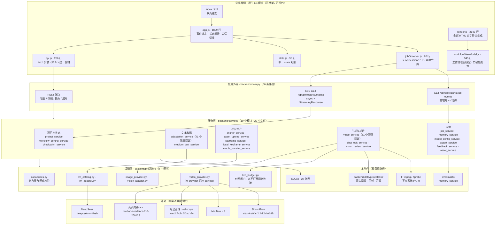
```mermaid
flowchart TB
  subgraph BROWSER["浏览器侧 · 原生 ES 模块（无框架 / 无打包）"]
    direction LR
    IDX["index.html<br/>单页骨架"]
    APP["app.js · 1829 行<br/>事件绑定 · 状态编排 · 会话切换"]
    RND["render.js · 2143 行<br/>全部 HTML 由字符串生成"]
    VM["workflowViewModel.js · 945 行<br/>工作流视图模型 · 门横幅判定"]
    API["api.js · 266 行<br/>fetch 封装 · 非 2xx 统一抛错"]
    OBS["jobObserver.js · 92 行<br/>isLiveSession 守卫 · 观察令牌"]
    ST["state.js · 98 行<br/>单一 state 对象"]
  end

  subgraph SHELL["应用外壳 · backend/main.py（66 条路由）"]
    R1["REST 端点<br/>项目 / 改编 / 镜头 / 成片"]
    SSE["SSE GET /api/projects/:id/events<br/>async + StreamingResponse"]
    POLL["GET /api/projects/:id/job-events<br/>前端每 4s 轮询"]
  end

  subgraph SVC["服务层 · backend/services（19 个模块 / 20 个文件）"]
    direction LR
    S1["项目与状态<br/>project_service<br/>workflow_control_service<br/>checkpoint_service"]
    S2["文本改编<br/>adaptation_service（41 个顶层函数）<br/>medium_text_service"]
    S3["视觉资产<br/>anchor_service · asset_upload_service<br/>keyframe_service · local_keyframe_service<br/>media_transfer_service"]
    S4["生成与成片<br/>video_service（51 个顶层函数）<br/>shot_edit_service · vision_review_service"]
    S5["支撑<br/>job_service · memory_service<br/>model_config_service · export_service<br/>feedback_service · asset_service"]
  end

  subgraph PROV["适配层 · backend/providers（8 个模块）"]
    P1["capabilities.py<br/>能力表与模式校验"]
    P2["llm_catalog.py · llm_adapter.py"]
    P3["image_provider.py · vision_adapter.py"]
    P4["video_provider.py<br/>按 provider 组装 payload"]
    P5["live_budget.py<br/>付费闸门 · 从不打开网络连接"]
  end

  subgraph EXT["外部（真实调用需授权）"]
    E1["DeepSeek<br/>deepseek-v4-flash"]
    E2["火山方舟 ark<br/>doubao-seedance-2-0-260128"]
    E3["阿里百炼 dashscope<br/>wan2.7-t2v / i2v / r2v"]
    E4["MiniMax H3"]
    E5["SiliconFlow<br/>Wan-AI/Wan2.2-T2V-A14B"]
  end

  subgraph LOCAL["本地件（零费用路径）"]
    L1["SQLite · 27 张表"]
    L2["ChromaDB<br/>memory_service"]
    L3["backend/data/projects/:id/<br/>镜头视频 · 首帧 · 音频"]
    L4["FFmpeg / ffprobe<br/>不在系统 PATH"]
  end

  APP --> API
  RND --> VM
  APP --> ST
  APP --> OBS
  IDX --> APP
  API --> R1
  OBS --> SSE
  OBS --> POLL
  R1 --> SVC
  SSE --> S1
  POLL --> S5
  SVC --> PROV
  S2 --> P2
  S3 --> P3
  S4 --> P4
  S4 --> P5
  P2 --> E1
  P4 --> E2
  P4 --> E3
  P4 --> E4
  P4 --> E5
  SVC --> L1
  S5 --> L2
  S4 --> L3
  S4 --> L4
```

---

## 图 2 · 六道门的状态机（真实状态名）

状态名与门名的对应关系取自 `backend/services/checkpoint_service.py` 的四张登记表
（`REVIEW_NODES` / `REVIEW_STATUSES` / `NODE_FOR_STATUS` / `PAUSE_REASON`）。

关键点：**门必须显式登记**。批量生成的放行判定是黑名单式的——不在 `REVIEW_NODES` 里，
就等于没有门。

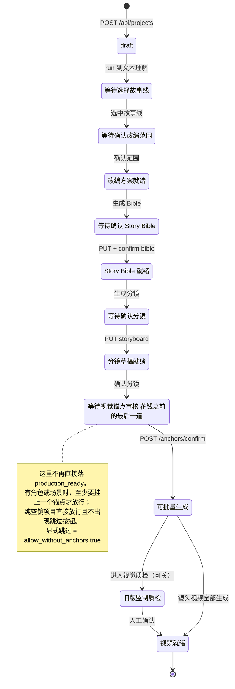
```mermaid
stateDiagram-v2
    [*] --> draft: POST /api/projects

    state "等待选择故事线" as awaiting_storyline_review
    state "等待确认改编范围" as awaiting_scope_review
    state "改编方案就绪" as adaptation_options_ready
    state "等待确认 Story Bible" as awaiting_bible_review
    state "Story Bible 就绪" as story_bible_ready
    state "等待确认分镜" as awaiting_storyboard_review
    state "分镜草稿就绪" as storyboard_draft_ready
    state "等待视觉锚点审核 花钱之前的最后一道" as awaiting_anchor_review
    state "可批量生成" as production_ready
    state "旧版监制质检" as review_pending
    state "视频就绪" as video_ready

    draft --> awaiting_storyline_review: run 到文本理解
    awaiting_storyline_review --> awaiting_scope_review: 选中故事线
    awaiting_scope_review --> adaptation_options_ready: 确认范围
    adaptation_options_ready --> awaiting_bible_review: 生成 Bible
    awaiting_bible_review --> story_bible_ready: PUT + confirm bible
    story_bible_ready --> awaiting_storyboard_review: 生成分镜
    awaiting_storyboard_review --> storyboard_draft_ready: PUT storyboard
    storyboard_draft_ready --> awaiting_anchor_review: 确认分镜

    note right of awaiting_anchor_review
      这里不再直接落 production_ready。
      有角色或场景时，至少要挂上一个锚点才放行；
      纯空镜项目直接放行且不出现跳过按钮。
      显式跳过 = allow_without_anchors true
    end note

    awaiting_anchor_review --> production_ready: POST /anchors/confirm

    production_ready --> review_pending: 进入视觉质检（可关）
    review_pending --> video_ready: 人工确认
    production_ready --> video_ready: 镜头视频全部生成

    video_ready --> [*]
```

门的四个登记字段互为闭环，缺一个就会出现「能点、无反应、无提示」：

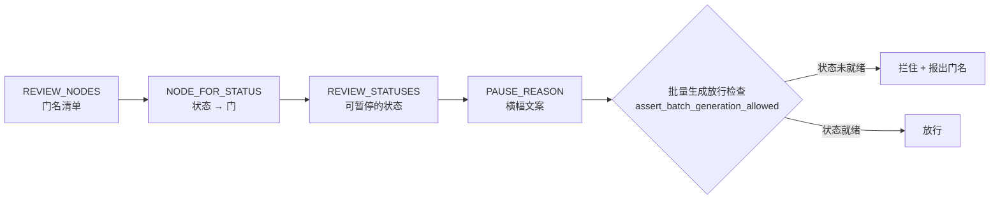
```mermaid
flowchart LR
  N["REVIEW_NODES<br/>门名清单"] --> M["NODE_FOR_STATUS<br/>状态 → 门"]
  M --> R["REVIEW_STATUSES<br/>可暂停的状态"]
  R --> P["PAUSE_REASON<br/>横幅文案"]
  P --> G{"批量生成放行检查<br/>assert_batch_generation_allowed"}
  G -- "状态未就绪" --> B["拦住 + 报出门名"]
  G -- "状态就绪" --> A["放行"]
```

---

## 图 3 · 付费闸门：判定顺序就是安全边界

全部实现在 `backend/providers/live_budget.py`，`check_live_video_budget()`（第 355 行起）。
**四步判定全部发生在打开任何 HTTP 连接之前。**

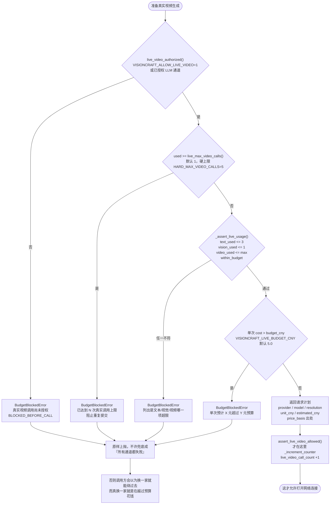
```mermaid
flowchart TB
  START(["准备真实视频生成"]) --> Q1{"live_video_authorized()<br/>VISIONCRAFT_ALLOW_LIVE_VIDEO=1<br/>或已授权 LLM 通道"}

  Q1 -- "否" --> X1["BudgetBlockedError<br/>真实视频调用尚未授权<br/>BLOCKED_BEFORE_CALL"]
  Q1 -- "是" --> Q2{"used >= live_max_video_calls()<br/>默认 1，硬上限 HARD_MAX_VIDEO_CALLS=5"}

  Q2 -- "是" --> X2["BudgetBlockedError<br/>已达到 N 次真实调用上限<br/>阻止重复提交"]
  Q2 -- "否" --> Q3{"_assert_live_usage()<br/>text_used <= 3<br/>vision_used <= 1<br/>video_used <= max<br/>within_budget"}

  Q3 -- "任一不符" --> X3["BudgetBlockedError<br/>列出是文本/视觉/视频哪一项超限"]
  Q3 -- "通过" --> Q4{"单次 cost > budget_cny<br/>VISIONCRAFT_LIVE_BUDGET_CNY 默认 5.0"}

  Q4 -- "是" --> X4["BudgetBlockedError<br/>单次预计 X 元超过 Y 元预算"]
  Q4 -- "否" --> PLAN["返回请求计划<br/>provider / model / resolution<br/>unit_cny / estimated_cny<br/>price_basis 出处"]

  PLAN --> INC["assert_live_video_allowed()<br/>才在这里 _increment_counter<br/>live_video_call_count +1"]
  INC --> NET(["这才允许打开网络连接"])

  X1 --> RAISE["原样上抛，不许兜底成<br/>『所有通道都失败』"]
  X2 --> RAISE
  X3 --> RAISE
  X4 --> RAISE
  RAISE --> WHY["否则调用方会以为换一家就能绕过去<br/>而真换一家就是在越过预算花钱"]
```

各家的单价表（`VIDEO_PRICE_CNY_PER_SECOND`，元/秒，括号内为「有输入视频 / 无输入视频」）：

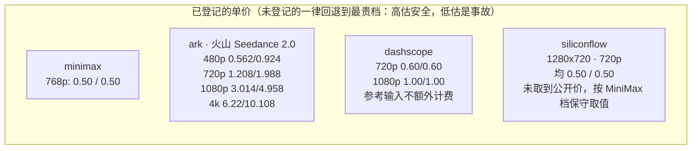
```mermaid
flowchart LR
  subgraph PRICE["已登记的单价（未登记的一律回退到最贵档：高估安全，低估是事故）"]
    direction TB
    M["minimax<br/>768p: 0.50 / 0.50"]
    A["ark · 火山 Seedance 2.0<br/>480p 0.562/0.924<br/>720p 1.208/1.988<br/>1080p 3.014/4.958<br/>4k 6.22/10.108"]
    D["dashscope<br/>720p 0.60/0.60<br/>1080p 1.00/1.00<br/>参考输入不额外计费"]
    S["siliconflow<br/>1280x720 · 720p<br/>均 0.50 / 0.50<br/>未取到公开价，按 MiniMax 档保守取值"]
  end
```

---

## 图 4 · 参考图模式：三家规则互不相同，必须分流

依据 `backend/providers/capabilities.py` 的 `_video_provider_catalog()`（第 227 行起）
与 `MODE_REQUIREMENTS["reference"]`（第 19 行：首帧否 / 尾帧否 / **必须有参考图**）。

**这是三家唯一不能共用一套 payload 的地方**，混发会被云端直接拒单。

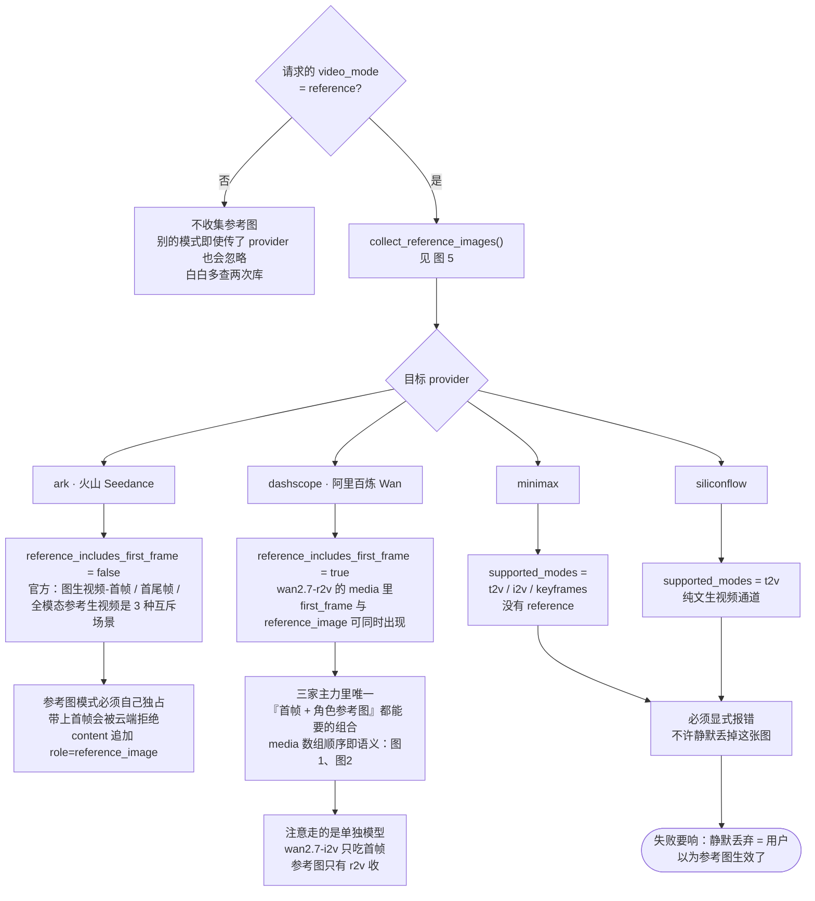
```mermaid
flowchart TB
  MODE{"请求的 video_mode<br/>= reference?"} -- 否 --> SKIP["不收集参考图<br/>别的模式即使传了 provider 也会忽略<br/>白白多查两次库"]
  MODE -- 是 --> COLLECT["collect_reference_images()<br/>见 图 5"]

  COLLECT --> SPLIT{"目标 provider"}
  SPLIT --> ARK["ark · 火山 Seedance"]
  SPLIT --> DASH["dashscope · 阿里百炼 Wan"]
  SPLIT --> MM["minimax"]
  SPLIT --> SF["siliconflow"]

  ARK --> ARK_RULE["reference_includes_first_frame = false<br/>官方：图生视频-首帧 / 首尾帧 /<br/>全模态参考生视频是 3 种互斥场景"]
  ARK_RULE --> ARK_OK["参考图模式必须自己独占<br/>带上首帧会被云端拒绝<br/>content 追加 role=reference_image"]

  DASH --> DASH_RULE["reference_includes_first_frame = true<br/>wan2.7-r2v 的 media 里<br/>first_frame 与 reference_image 可同时出现"]
  DASH_RULE --> DASH_OK["三家主力里唯一<br/>『首帧 + 角色参考图』都能要的组合<br/>media 数组顺序即语义：图1、图2"]
  DASH_OK --> DASH_MODEL["注意走的是单独模型<br/>wan2.7-i2v 只吃首帧<br/>参考图只有 r2v 收"]

  MM --> MM_NO["supported_modes =<br/>t2v / i2v / keyframes<br/>没有 reference"]
  MM_NO --> LOUD["必须显式报错<br/>不许静默丢掉这张图"]

  SF --> SF_NO["supported_modes = t2v<br/>纯文生视频通道"]
  SF_NO --> LOUD

  LOUD --> FAIL(["失败要响：静默丢弃 = 用户以为参考图生效了"])
```

四家的能力边界（含各家默认档位，与 `live_budget.VIDEO_DEFAULT_RESOLUTION` 必须一致）：

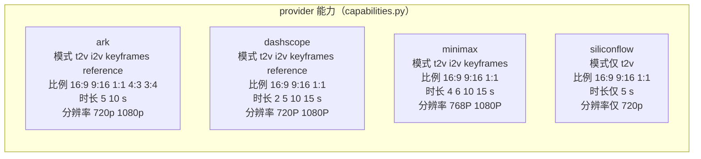
```mermaid
flowchart LR
  subgraph CAP["provider 能力（capabilities.py）"]
    direction TB
    C1["ark<br/>模式 t2v i2v keyframes reference<br/>比例 16:9 9:16 1:1 4:3 3:4<br/>时长 5 10 s<br/>分辨率 720p 1080p"]
    C2["dashscope<br/>模式 t2v i2v keyframes reference<br/>比例 16:9 9:16 1:1<br/>时长 2 5 10 15 s<br/>分辨率 720P 1080P"]
    C3["minimax<br/>模式 t2v i2v keyframes<br/>比例 16:9 9:16 1:1<br/>时长 4 6 10 15 s<br/>分辨率 768P 1080P"]
    C4["siliconflow<br/>模式仅 t2v<br/>比例 16:9 9:16 1:1<br/>时长仅 5 s<br/>分辨率仅 720p"]
  end
```

---

## 图 5 · 参考图数据通路：从 Bible 卡片一路进到 provider payload

**注意**：这条链路已经接通（提交记录 `4718289 feat: let reference images reach the video providers`
与 `e2ea1b2 test: pin the reference-mode contract and align the gate banner`）。
但它只是**代码层面的接通**，从未经过真实付费调用验收——「能组装出 payload」与
「云端收下并真的按参考图生成」是两件事。

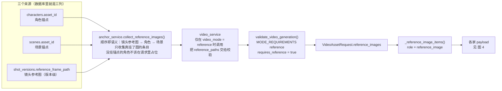
```mermaid
flowchart LR
  subgraph SRC["三个来源（数据库里就是三列）"]
    A1["characters.asset_id<br/>角色锚点"]
    A2["scenes.asset_id<br/>场景锚点"]
    A3["shot_versions.reference_frame_path<br/>镜头参考图（版本级）"]
  end

  A1 --> CR
  A2 --> CR
  A3 --> CR

  CR["anchor_service.collect_reference_images()<br/>顺序即语义：镜头参考图 → 角色 → 场景<br/>只收集真挂了图的条目<br/>没挂锚点的角色不该在请求里占位"]

  CR --> VS["video_service<br/>仅在 video_mode = reference 时调用<br/>把 reference_paths 交给校验"]
  VS --> VAL["validate_video_generation()<br/>MODE_REQUIREMENTS reference<br/>requires_reference = true"]
  VAL --> REQ["VideoAssetRequest.reference_images"]
  REQ --> ITEMS["_reference_image_items()<br/>role = reference_image"]
  ITEMS --> PAY["各家 payload<br/>见 图 4"]
```

---

## 图 6 · 数据库 27 张表按职责分域

表名来自 `backend/schema.sql`，与真实库 `backend/data/visioncraft.db` 的
`sqlite_master` 实测一致（27 张，不含 `sqlite_%`）。

**分域是我按职责归纳的，不是代码里的既有结构**——表本身是硬的，分组是解释性的。

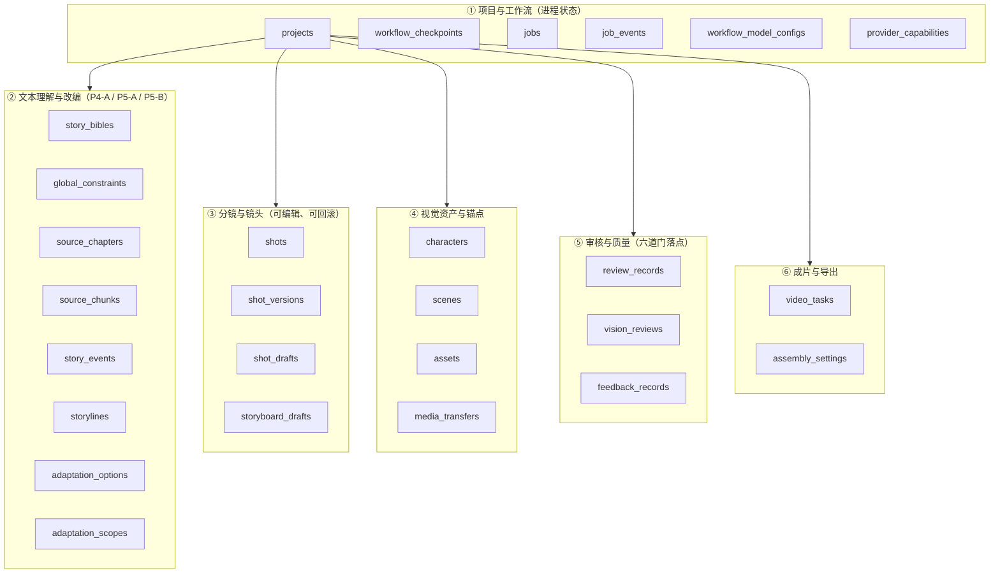
```mermaid
flowchart TB
  subgraph D1["① 项目与工作流（进程状态）"]
    projects
    workflow_checkpoints
    jobs
    job_events
    workflow_model_configs
    provider_capabilities
  end

  subgraph D2["② 文本理解与改编（P4-A / P5-A / P5-B）"]
    story_bibles
    global_constraints
    source_chapters
    source_chunks
    story_events
    storylines
    adaptation_options
    adaptation_scopes
  end

  subgraph D3["③ 分镜与镜头（可编辑、可回滚）"]
    shots
    shot_versions
    shot_drafts
    storyboard_drafts
  end

  subgraph D4["④ 视觉资产与锚点"]
    characters
    scenes
    assets
    media_transfers
  end

  subgraph D5["⑤ 审核与质量（六道门落点）"]
    review_records
    vision_reviews
    feedback_records
  end

  subgraph D6["⑥ 成片与导出"]
    video_tasks
    assembly_settings
  end

  projects --> D2
  projects --> D3
  projects --> D4
  projects --> D5
  projects --> D6
```

三条容易被忽略的约束：

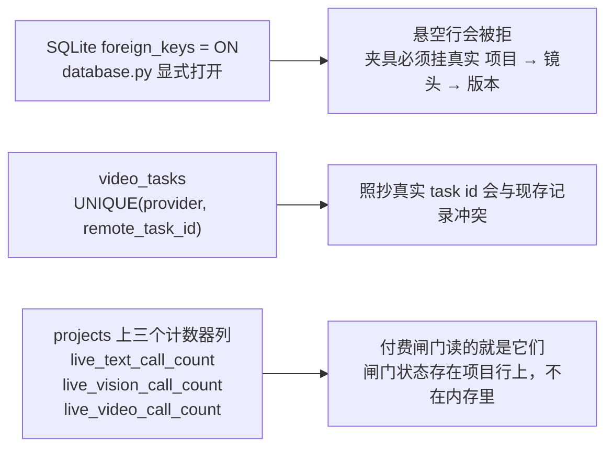
```mermaid
flowchart LR
  C1["SQLite foreign_keys = ON<br/>database.py 显式打开"] --> N1["悬空行会被拒<br/>夹具必须挂真实 项目 → 镜头 → 版本"]
  C2["video_tasks<br/>UNIQUE(provider, remote_task_id)"] --> N2["照抄真实 task id 会与现存记录冲突"]
  C3["projects 上三个计数器列<br/>live_text_call_count<br/>live_vision_call_count<br/>live_video_call_count"] --> N3["付费闸门读的就是它们<br/>闸门状态存在项目行上，不在内存里"]
```

---

## 图 7 · 无费用回归驱动器的结构（58 项）

项数实测自 `tools/run_no_cost_regression.py` 的 `build_checks()`：静态 7 +
Node 6 / Python 31 / 浏览器 14 = 58。注意浏览器组第 14 项
`test_live_2shot_create_guard.cjs` 是**手工 append 在元组之外**的，只数元组会误算成 13。

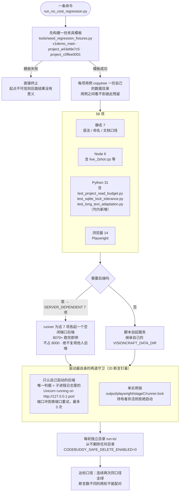
```mermaid
flowchart TB
  START(["一条命令<br/>run_no_cost_regression.py"]) --> TPL["先构建一份夹具模板<br/>tools/seed_regression_fixtures.py<br/>v1demo_main · project_a43afde7c5 · project_c0ffee0001"]
  TPL -- "模板失败" --> ABORT["直接终止<br/>起点不可信则后面结果没有意义"]
  TPL -- "模板成功" --> COPY["每项用例 copytree 一份自己的数据目录<br/>用例之间看不到彼此残留"]

  COPY --> GROUPS

  subgraph GROUPS["58 项"]
    direction LR
    G1["静态 7<br/>语法 / 命名 / 文档口径"]
    G2["Node 6<br/>含 live_2shot.cjs 等"]
    G3["Python 31<br/>含 test_project_read_budget.py<br/>test_sqlite_lock_tolerance.py<br/>test_long_text_adaptation.py（均为新增）"]
    G4["浏览器 14<br/>Playwright"]
  end

  GROUPS --> NEED{"需要后端吗"}
  NEED -- "是 → SERVER_DEPENDENT 7 项" --> SRV["runner 为这 7 项各起一个空闲端口后端<br/>8070+ 跑完即停<br/>不占 8000 · 绝不复用他人后端"]
  NEED -- "否" --> SELF["脚本自起服务<br/>继承自己的 VISIONCRAFT_DATA_DIR"]
  SRV --> GUARD
  SELF --> GUARD

  subgraph GUARD["驱动器自身的两道守卫（20 断言钉着）"]
    direction TB
    U1["只认自己启动的后端<br/>唯一判据 = 子进程日志里的<br/>Uvicorn running on http://127.0.0.1:port<br/>端口冲突换端口重试，最多 3 次"]
    U2["单实例锁<br/>output/playwright/stageC/runner.lock<br/>持有者存活则拒绝启动"]
  end

  GUARD --> OUT["每轮独立目录 run-ts/<br/>从不删除任何目录<br/>CODEBUDDY_SAFE_DELETE_ENABLED=0"]
  OUT --> VERD["达标口径：连续两次同口径全绿<br/>断言数不同的两轮不能配对"]
```

驱动器两道守卫各自的失败模式（这两条都是实测踩出来的，不是设想）：

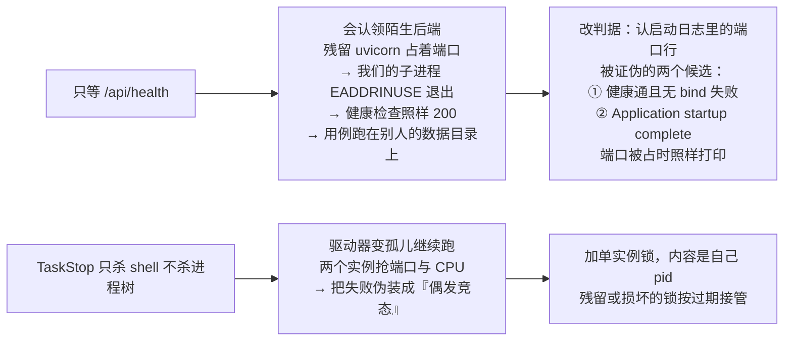
```mermaid
flowchart LR
  F1["只等 /api/health"] --> B1["会认领陌生后端<br/>残留 uvicorn 占着端口<br/>→ 我们的子进程 EADDRINUSE 退出<br/>→ 健康检查照样 200<br/>→ 用例跑在别人的数据目录上"]
  F2["TaskStop 只杀 shell 不杀进程树"] --> B2["驱动器变孤儿继续跑<br/>两个实例抢端口与 CPU<br/>→ 把失败伪装成『偶发竞态』"]
  B1 --> FIX1["改判据：认启动日志里的端口行<br/>被证伪的两个候选：<br/>① 健康通且无 bind 失败<br/>② Application startup complete<br/>端口被占时照样打印"]
  B2 --> FIX2["加单实例锁，内容是自己 pid<br/>残留或损坏的锁按过期接管"]
```

---

## 图 8 · 项目读取路径：修复前 vs 修复后

这是 2026-09-27 那轮排查的结论图。**根因是「每读一次项目要同步跑 N 次 ffprobe」**——
本机单次 `ffprobe` 实测 886～1136 ms（进程启动 + 杀软扫描）。

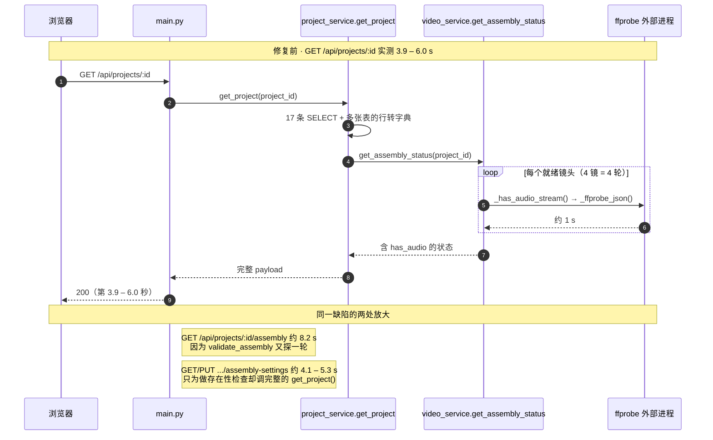
```mermaid
sequenceDiagram
    autonumber
    participant U as 浏览器
    participant API as main.py
    participant PS as project_service.get_project
    participant VS as video_service.get_assembly_status
    participant FP as ffprobe 外部进程

    Note over U,FP: 修复前 · GET /api/projects/:id 实测 3.9 – 6.0 s
    U->>API: GET /api/projects/:id
    API->>PS: get_project(project_id)
    PS->>PS: 17 条 SELECT + 多张表的行转字典
    PS->>VS: get_assembly_status(project_id)
    loop 每个就绪镜头（4 镜 = 4 轮）
        VS->>FP: _has_audio_stream() → _ffprobe_json()
        FP-->>VS: 约 1 s
    end
    VS-->>PS: 含 has_audio 的状态
    PS-->>API: 完整 payload
    API-->>U: 200（第 3.9 – 6.0 秒）

    Note over U,FP: 同一缺陷的两处放大
    Note right of API: GET /api/projects/:id/assembly 约 8.2 s<br/>因为 validate_assembly 又探一轮
    Note right of API: GET/PUT .../assembly-settings 约 4.1 – 5.3 s<br/>只为做存在性检查却调完整的 get_project()
```

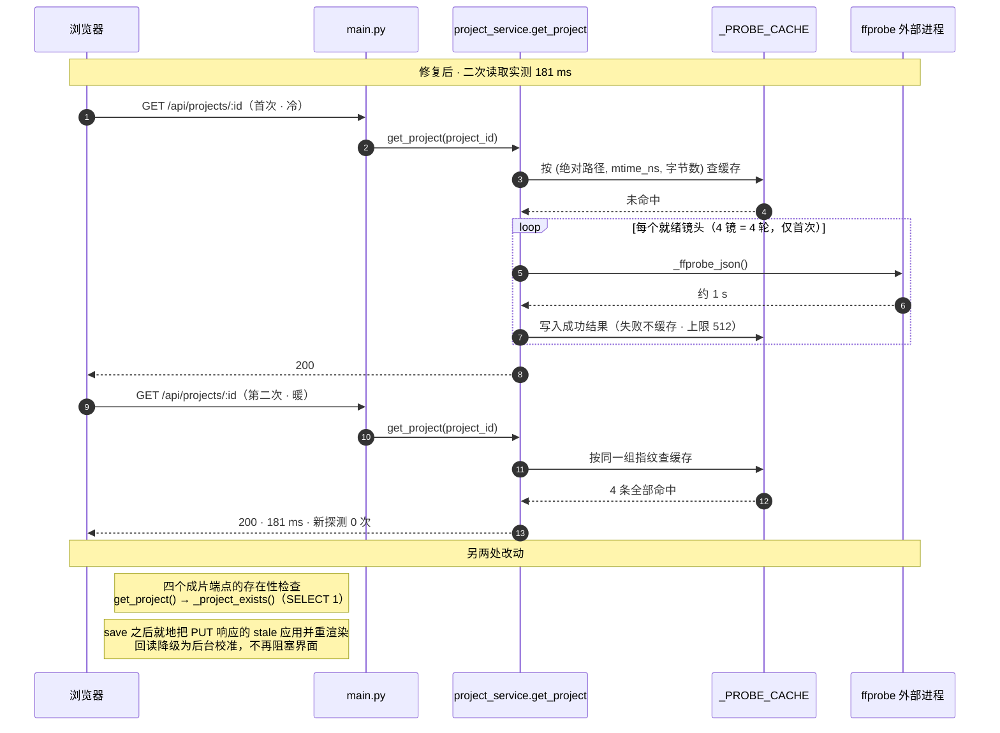
```mermaid
sequenceDiagram
    autonumber
    participant U as 浏览器
    participant API as main.py
    participant PS as project_service.get_project
    participant C as _PROBE_CACHE
    participant FP as ffprobe 外部进程

    Note over U,FP: 修复后 · 二次读取实测 181 ms
    U->>API: GET /api/projects/:id（首次 · 冷）
    API->>PS: get_project(project_id)
    PS->>C: 按 (绝对路径, mtime_ns, 字节数) 查缓存
    C-->>PS: 未命中
    loop 每个就绪镜头（4 镜 = 4 轮，仅首次）
        PS->>FP: _ffprobe_json()
        FP-->>PS: 约 1 s
        PS->>C: 写入成功结果（失败不缓存 · 上限 512）
    end
    PS-->>U: 200

    U->>API: GET /api/projects/:id（第二次 · 暖）
    API->>PS: get_project(project_id)
    PS->>C: 按同一组指纹查缓存
    C-->>PS: 4 条全部命中
    PS-->>U: 200 · 181 ms · 新探测 0 次

    Note over U,FP: 另两处改动
    Note left of API: 四个成片端点的存在性检查<br/>get_project() → _project_exists()（SELECT 1）
    Note left of API: save 之后就地把 PUT 响应的 stale 应用并重渲染<br/>回读降级为后台校准，不再阻塞界面
```

缓存失效的判定：**文件被替换或改写就自动失效**（`mtime_ns` 变），不引入「陈旧元数据」新缺陷。

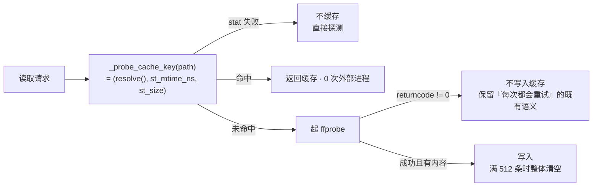
```mermaid
flowchart LR
  R["读取请求"] --> K["_probe_cache_key(path)<br/>= (resolve(), st_mtime_ns, st_size)"]
  K -- "stat 失败" --> NC["不缓存<br/>直接探测"]
  K -- "命中" --> HIT["返回缓存 · 0 次外部进程"]
  K -- "未命中" --> RUN["起 ffprobe"]
  RUN -- "returncode != 0" --> FAIL["不写入缓存<br/>保留『每次都会重试』的既有语义"]
  RUN -- "成功且有内容" --> PUT["写入<br/>满 512 条时整体清空"]
```

---

## 图 9 · p6d 用例为什么从红变绿

`tools/p6d_assembly.cjs:105` 用**写死的 10 秒**等 `#assemblyFreshness` 出现「已过期」。

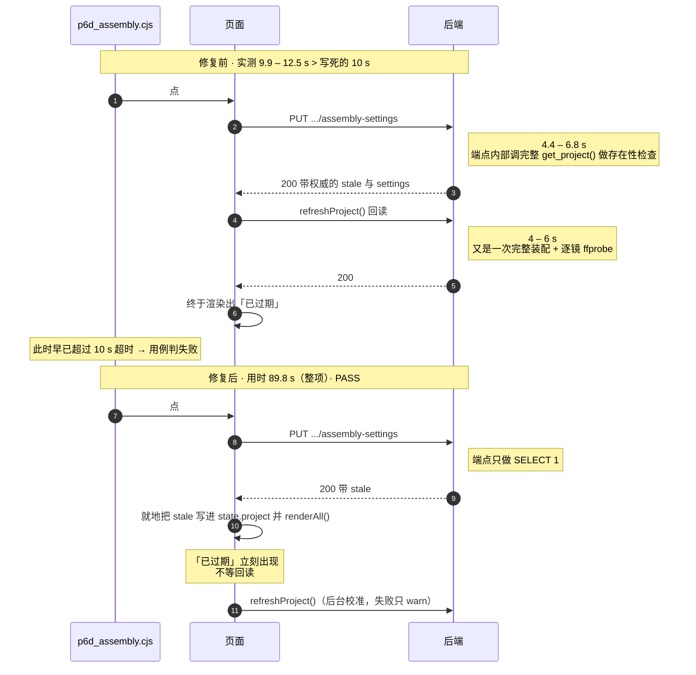
```mermaid
sequenceDiagram
    autonumber
    participant T as p6d_assembly.cjs
    participant P as 页面
    participant API as 后端

    Note over T,API: 修复前 · 实测 9.9 – 12.5 s > 写死的 10 s
    T->>P: 点 #saveAssemblySettingsBtn
    P->>API: PUT .../assembly-settings
    Note right of API: 4.4 – 6.8 s<br/>端点内部调完整 get_project() 做存在性检查
    API-->>P: 200 带权威的 stale 与 settings
    P->>API: refreshProject() 回读
    Note right of API: 4 – 6 s<br/>又是一次完整装配 + 逐镜 ffprobe
    API-->>P: 200
    P->>P: 终于渲染出「已过期」
    Note over T: 此时早已超过 10 s 超时 → 用例判失败

    Note over T,API: 修复后 · 用时 89.8 s（整项）· PASS
    T->>P: 点 #saveAssemblySettingsBtn
    P->>API: PUT .../assembly-settings
    Note right of API: 端点只做 SELECT 1
    API-->>P: 200 带 stale
    P->>P: 就地把 stale 写进 state.project 并 renderAll()
    Note over P: 「已过期」立刻出现<br/>不等回读
    P->>API: refreshProject()（后台校准，失败只 warn）
```

**排查过程中留下的一条方法论**：`uvicorn` 只在**响应写完**时才记一行访问日志。
所以「access log 里没有某条请求」**不能**推出「请求没有发出」——超时被杀掉的那条请求
根本来不及写完。这条曾经把排查引向错误结论。

---

## 图 10 · 工作流动作与端点的对应

左侧是用户动作，右侧是端点（`backend/main.py`，共 66 条，此处列出主干）。

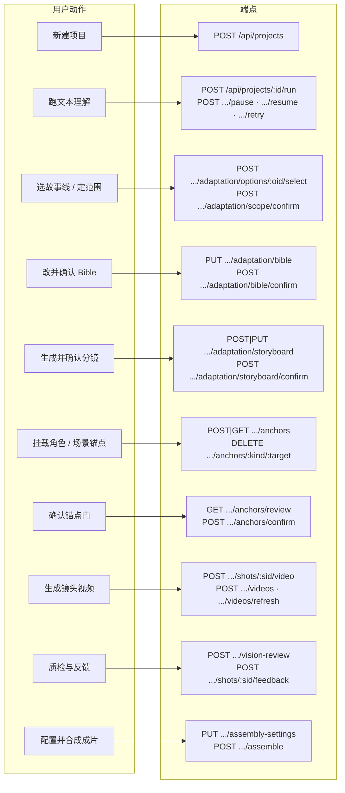
```mermaid
flowchart LR
  subgraph ACT["用户动作"]
    direction TB
    A1["新建项目"]
    A2["跑文本理解"]
    A3["选故事线 / 定范围"]
    A4["改并确认 Bible"]
    A5["生成并确认分镜"]
    A6["挂载角色 / 场景锚点"]
    A7["确认锚点门"]
    A8["生成镜头视频"]
    A9["质检与反馈"]
    A10["配置并合成成片"]
  end

  subgraph EP["端点"]
    direction TB
    E1["POST /api/projects"]
    E2["POST /api/projects/:id/run<br/>POST .../pause · .../resume · .../retry"]
    E3["POST .../adaptation/options/:oid/select<br/>POST .../adaptation/scope/confirm"]
    E4["PUT .../adaptation/bible<br/>POST .../adaptation/bible/confirm"]
    E5["POST|PUT .../adaptation/storyboard<br/>POST .../adaptation/storyboard/confirm"]
    E6["POST|GET .../anchors<br/>DELETE .../anchors/:kind/:target"]
    E7["GET .../anchors/review<br/>POST .../anchors/confirm"]
    E8["POST .../shots/:sid/video<br/>POST .../videos · .../videos/refresh"]
    E9["POST .../vision-review<br/>POST .../shots/:sid/feedback"]
    E10["PUT .../assembly-settings<br/>POST .../assemble"]
  end

  A1 --> E1
  A2 --> E2
  A3 --> E3
  A4 --> E4
  A5 --> E5
  A6 --> E6
  A7 --> E7
  A8 --> E8
  A9 --> E9
  A10 --> E10
```

其中只有三处会碰到真实付费通道，且都经过图 3 那道闸门：

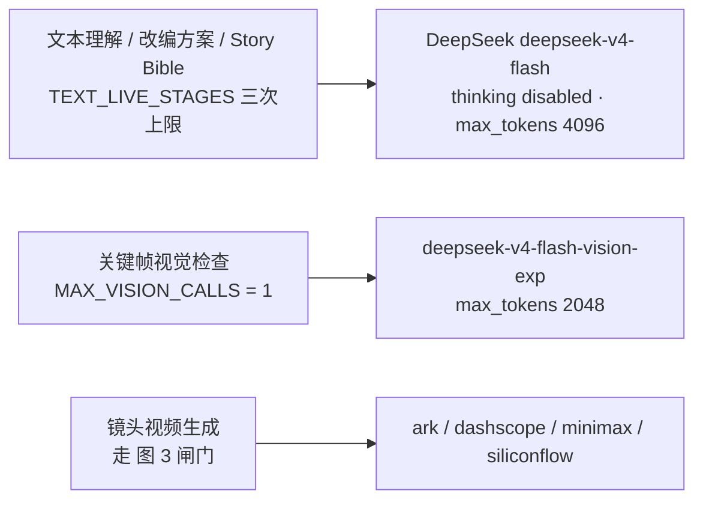
```mermaid
flowchart LR
  T1["文本理解 / 改编方案 / Story Bible<br/>TEXT_LIVE_STAGES 三次上限"] --> L["DeepSeek deepseek-v4-flash<br/>thinking disabled · max_tokens 4096"]
  T2["关键帧视觉检查<br/>MAX_VISION_CALLS = 1"] --> L2["deepseek-v4-flash-vision-exp<br/>max_tokens 2048"]
  T3["镜头视频生成<br/>走 图 3 闸门"] --> L3["ark / dashscope / minimax / siliconflow"]
```

---

## 图 11 · P5-B-1 长文本：章节树 → 逐章分块 → 按章范围

出处：`backend/workflow/medium_text_planner.py`（`parse_chapters` / `segment_source`）、
`backend/services/medium_text_service.py`（`save_adaptation_scope` / `_chunk_ids_for_chapters`）、
`frontend/js/render.js`（`chapterTreeHtml`）。数字取自 `tools/test_long_text_adaptation.py` 实测。

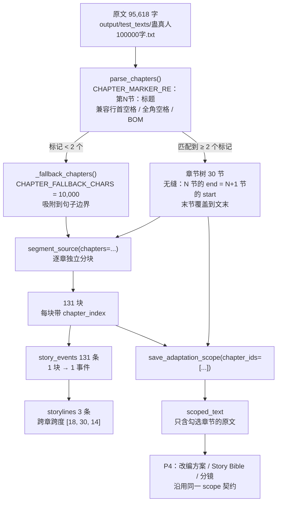
```mermaid
flowchart TB
  SRC["原文 95,618 字<br/>output/test_texts/蛊真人100000字.txt"] --> PARSE["parse_chapters()<br/>CHAPTER_MARKER_RE：第N节：标题<br/>兼容行首空格 / 全角空格 / BOM"]
  PARSE -->|"匹配到 ≥ 2 个标记"| CH["章节树 30 节<br/>无缝：N 节的 end = N+1 节的 start<br/>末节覆盖到文末"]
  PARSE -->|"标记 &lt; 2 个"| FB["_fallback_chapters()<br/>CHAPTER_FALLBACK_CHARS = 10,000<br/>吸附到句子边界"]
  CH --> SEG["segment_source(chapters=...)<br/>逐章独立分块"]
  FB --> SEG
  SEG --> CHUNKS["131 块<br/>每块带 chapter_index"]
  CHUNKS --> EV["story_events 131 条<br/>1 块 → 1 事件"]
  EV --> SL["storylines 3 条<br/>跨章跨度 [18, 30, 14]"]
  CH --> SCOPE["save_adaptation_scope(chapter_ids=[...])"]
  CHUNKS --> SCOPE
  SCOPE --> OUT["scoped_text<br/>只含勾选章节的原文"]
  OUT --> P4["P4：改编方案 / Story Bible / 分镜<br/>沿用同一 scope 契约"]
```

四条是靠这张图才能看出来的不变量：

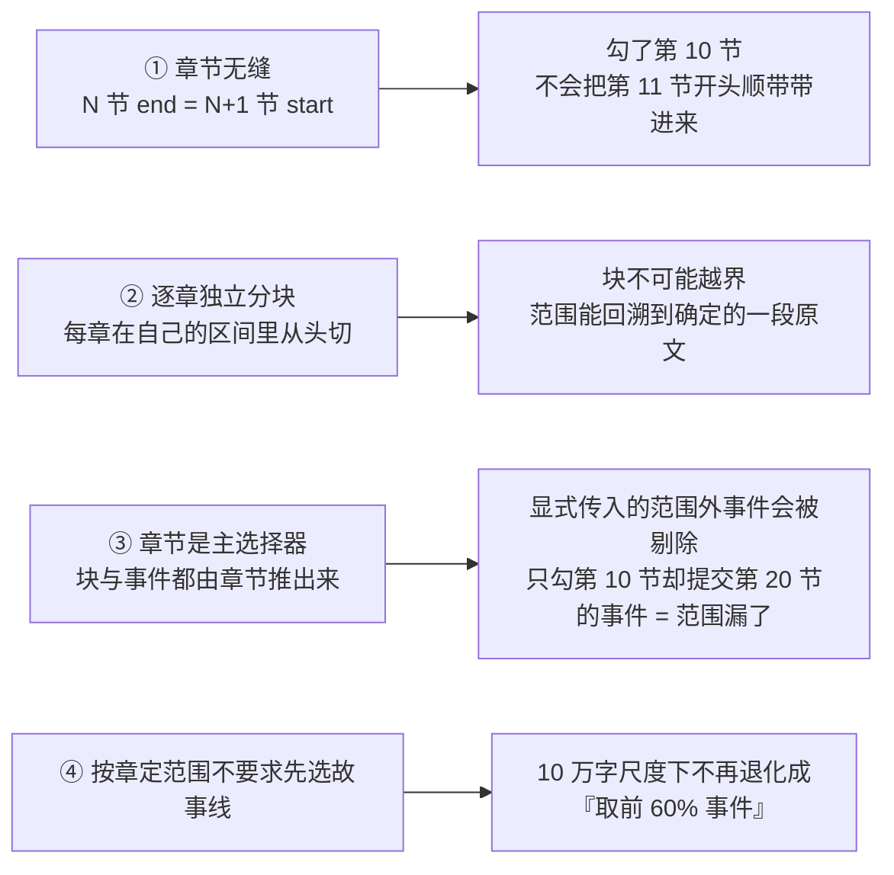
```mermaid
flowchart LR
  I1["① 章节无缝<br/>N 节 end = N+1 节 start"] --> R1["勾了第 10 节<br/>不会把第 11 节开头顺带带进来"]
  I2["② 逐章独立分块<br/>每章在自己的区间里从头切"] --> R2["块不可能越界<br/>范围能回溯到确定的一段原文"]
  I3["③ 章节是主选择器<br/>块与事件都由章节推出来"] --> R3["显式传入的范围外事件会被剔除<br/>只勾第 10 节却提交第 20 节的事件 = 范围漏了"]
  I4["④ 按章定范围不要求先选故事线"] --> R4["10 万字尺度下不再退化成<br/>『取前 60% 事件』"]
```

**这张图不包含什么**（避免把 P5-B-1 读成 P5-B 的全部）：

- **没有向量检索、全文索引、真实 Embedding / RAG 召回**。这里范围的收缩是**结构性的**——
  靠章节偏移裁剪，不是语义召回。文档里凡写"检索"处都该按前者理解。
- 图里没画的两个入口缺陷（都在 2026-09-28 修掉，但值得记住形状）：
  `start_adaptation_workflow` 里残留的 `scale == "long" → raise TEXT_TOO_LONG` 把长文本挡在门外；
  拆出 `over_limit` 之后，**超过 10 万字的文本会掉到短文本路径**（不报错、不分章，整本塞进改编）。
  → 纯函数全绿不代表入口打通。

---

## 附：本文件里所有数字的出处

| 数字 | 出处 |
|---|---|
| 66 条路由 | `backend/main.py` 正则统计装饰器 `@app.<method>` |
| 19 个服务模块 / 20 个文件 | `backend/services/` 目录（含 `__init__.py`） |
| 8 个 provider 模块 | `backend/providers/`（含 `__init__.py`） |
| 前端 6 个 ES 模块与行数 | `frontend/js/` 逐文件统计 |
| 27 张表 | `backend/schema.sql`，与真实库 `sqlite_master` 实测一致 |
| 6 道门 / 9 个状态 | `backend/services/checkpoint_service.py` 四张登记表 |
| 单价与预算 5.0 元 | `backend/providers/live_budget.py` |
| 58 项 / 分组 | `tools/run_no_cost_regression.py` 的 `build_checks()` 实测 |
| ffprobe 886 – 1136 ms | 本机单进程实测；排除过程与取证见交付文档 §14.19.2 |
| 3.9 – 6.0 s / 8.2 s / 4.1 – 5.3 s | 同一端点三路交叉验证（node `http` · TestClient · TTFB），见 §14.19.2 |
| 9.9 – 12.5 s / 181 ms / 89.8 s | 页面内打桩 `fetch` 实测 + 回归日志，见 §14.19.2 / §14.19.4 |

> 上表不含一次性临时脚本路径：取证脚本是当轮用完即清的，可复核的是上面这些
> **已提交**的位置（代码文件与交付文档），不是当时的探针。
>
> 本文件的 mermaid 块经本机 Chromium + mermaid@11 **真实渲染校验**（**当前 20/20 可渲染**，
> 逐块尺寸/节点数留证），不是只检查语法。改动本文件后**建议用任意 Mermaid 渲染器重跑一遍**——
> 结构体检只证明括号平，不证明 mermaid 能解析。
>
> **2026-09-28 重跑**（P5-B-1 改动后：图 6 增 `source_chapters` 节点、图 7 计数 57→58、
> 新增图 11）：**20/20 可渲染**。
>
> ⚠️ **块号 ≠ 图号**：探针按 mermaid 块在文件里出现的顺序编号，而一张图可能含多个块，
> 所以引用尺寸时必须写明"块 N"。当前对应关系：图 6 = 块 9+10，图 7 = 块 11+12，
> 图 11 = 块 19+20（其余图一律一块）。本文件旧版本曾把块号当图号写（写成"图 6 = 1189×1290"，
> 而 1189×1290 其实是块 6、也就是**图 4** 的第一块），该口径已作废。
>
> 本轮实测（块号 → 尺寸 / 节点 / 边）：
> - 图 6：块 9 = 1775×1022 / 33 / 5，块 10 = 586×434 / 6 / 3
> - 图 7：块 11 = 814×2168 / 17 / 11，块 12 = 896×390 / 6 / 4
> - 图 11（新增）：块 19 = 622×1182 / 11 / 12，块 20 = 586×574 / 8 / 4
>
> 渲染器 = 本机 `.playwright-cli` 里的 playwright 1.55.1 + Chromium 1193 + mermaid 11，
> 脚本为一次性探针（未提交）。
